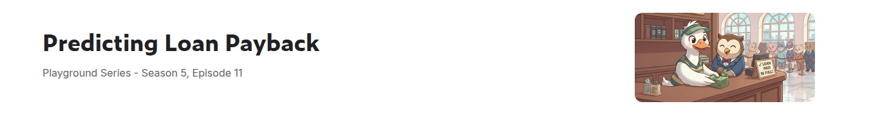
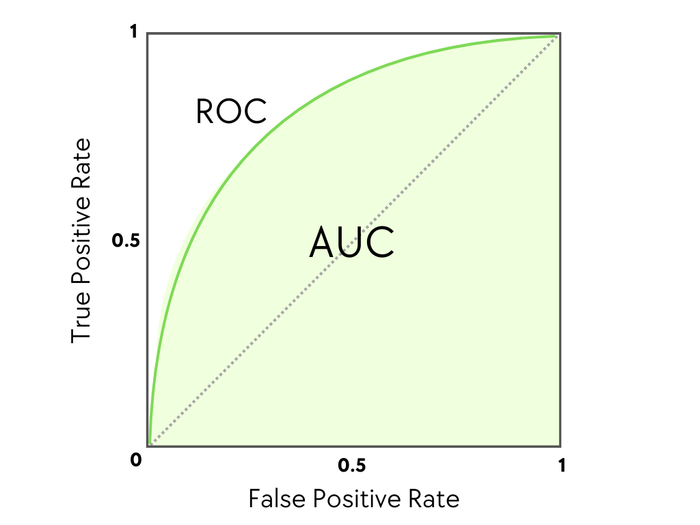

# Predicting Loan Payback - Kaggle Competition



This project is part of the **Kaggle Playground Series (Season 5, Episode 11)** competition, predicting whether a borrower will repay their loan based on financial and demographic features.

## Project Overview

The goal is to build a machine learning model that predicts loan repayment likelihood. The competition uses **AUC-ROC** as the evaluation metric, which is well-suited for this binary classification problem with class imbalance (~80% repaid, ~20% default).



## Project Structure

```
Predicting-Loan-Payback-Kaggle-Competition/
├── data/
│   ├── train.csv               # Training dataset (593,994 samples)
│   ├── test.csv                # Test dataset (254,569 samples)
│   └── sample_submission.csv
├── models/
│   ├── best_catboost_model.joblib
│   ├── best_lgbm_model.joblib
│   ├── best_logreg_model.joblib
│   ├── best_naive_bayes_model.joblib
│   ├── best_rf_model.joblib
│   ├── best_tree_model.joblib
│   └── best_xgboost_model.joblib
├── assets/
│   ├── AUC-ROC.png
│   └── challenge.png
├── docs/
│   └── presentation.pdf
├── predecting_load_payback_kaggle_competition.ipynb
├── requirements.txt
└── README.md
```

## Dataset Description

**Train:** 593,994 samples | **Test:** 254,569 samples | **No missing values**

### Features

#### Numerical (5)
| Feature | Description |
|---|---|
| `annual_income` | Borrower's yearly income |
| `debt_to_income_ratio` | Ratio of debt to income (lower = better) |
| `credit_score` | FICO score (300–849; 740+ = Excellent) |
| `loan_amount` | Amount of the loan |
| `interest_rate` | Annual interest rate (%) |

#### Categorical (6)
| Feature | Values |
|---|---|
| `gender` | Male, Female |
| `marital_status` | Single, Married, Divorced |
| `education_level` | High School, Bachelor's, Master's, PhD |
| `employment_status` | Employed, Self-Employed, Unemployed |
| `loan_purpose` | Car, Education, Home, Medical, Debt consolidation, Other |
| `grade_subgrade` | Risk category (A1–G5) |

#### Target Variable
- `loan_paid_back`: **1.0** = repaid in full, **0.0** = defaulted

**Class distribution:** ~80% repaid, ~20% defaulted (moderate imbalance)

## Methodology

### 1. Exploratory Data Analysis
- Verified zero null values and no duplicates
- Chi-Square tests to assess categorical feature significance — `marital_status` dropped (weak association with target)
- Distribution drift analysis between train and test sets confirmed consistency
- Outlier detection via IQR method (~1.60% average outlier rate across features)

### 2. Feature Engineering

11 domain-specific features created on top of the original 11:

| Feature | Description |
|---|---|
| `income_loan_ratio` | Annual income / loan amount |
| `loan_to_income` | Loan amount / annual income |
| `total_debt` | debt_to_income_ratio × annual_income |
| `available_income` | Income × (1 − debt_to_income_ratio) |
| `debt_burden` | debt_to_income_ratio × loan_amount |
| `monthly_payment` | Estimated monthly payment |
| `payment_to_income` | Monthly payment / monthly income |
| `affordability` | Available income / loan amount |
| `default_risk` | Custom risk score (debt ratio 40% + credit 35% + rate 25%) |
| `credit_utilization` | credit_score × (1 − debt_to_income_ratio) |
| `credit_interest_product` | credit_score × interest_rate / 100 |
| `annual_income_log` | Log-transformed annual income |
| `loan_amount_log` | Log-transformed loan amount |

### 3. Preprocessing
- **Outlier removal:** IQR method (factor = 1.5) on numerical columns
- **Feature dropped:** `marital_status` (Chi-Square test showed no significant association)
- **Numerical scaling:** StandardScaler (mean = 0, std = 1)
- **Categorical encoding:** One-Hot Encoding with `drop_first=True` → 65 total features

### 4. Model Training
- **Validation:** Stratified K-Fold (8 splits) to preserve class ratio
- **Tuning:** GridSearchCV with AUC-ROC as scoring metric
- **Persistence:** Best models saved via `joblib`

## Results

| Model | Best Params | CV AUC-ROC |
|---|---|---|
| Naive Bayes (Bernoulli) | default | 0.8645 |
| Naive Bayes (Gaussian) | default | 0.8782 |
| Random Forest | depth=6, n=500, leaf=50 | 0.9011 |
| Logistic Regression | C=0.1, L1, balanced | 0.9112 |
| Decision Tree | depth=8, leaf=50 | 0.9115 |
| Stacking (LGBM + XGB + Cat → LR) | see notebook | 0.9191 |
| XGBoost | depth=8, n=1000, lr=0.05 | 0.9195 |
| **CatBoost** | **depth=8, n=1000, lr=0.1** | **0.9213** |

**Submission:** LightGBM model used for final test predictions (`predict_proba`).

## Models Implemented

1. **Logistic Regression** — linear baseline with L1/L2/ElasticNet regularization
2. **Naive Bayes** — BernoulliNB and GaussianNB variants
3. **Decision Tree** — tuned depth and leaf constraints
4. **Random Forest** — bagging ensemble of decision trees
5. **XGBoost** — extreme gradient boosting
6. **LightGBM** — fast leaf-wise gradient boosting (Microsoft)
7. **CatBoost** — symmetric-tree gradient boosting (Yandex)
8. **Stacking Classifier** — LGBM + XGBoost + CatBoost base learners with Logistic Regression meta-learner

## Getting Started

### Prerequisites

- Python 3.8+
- Jupyter Notebook or JupyterLab

### Installation

```bash
git clone https://github.com/yourusername/Predicting-Loan-Payback-Kaggle-Competition.git
cd Predicting-Loan-Payback-Kaggle-Competition
python -m venv venv
source venv/bin/activate  # Windows: venv\Scripts\activate
pip install -r requirements.txt
```

### Usage

```bash
jupyter notebook predecting_load_payback_kaggle_competition.ipynb
```

Run cells sequentially to reproduce: EDA → Feature Engineering → Preprocessing → Training → Submission.

## Technologies Used

| Library | Purpose |
|---|---|
| pandas, numpy | Data manipulation |
| scikit-learn | ML algorithms, preprocessing, cross-validation |
| LightGBM | Gradient boosting |
| XGBoost | Gradient boosting |
| CatBoost | Gradient boosting |
| scipy | Statistical tests (Chi-Square) |
| matplotlib, seaborn | Visualization |
| joblib | Model persistence |
| jupyter | Interactive development |

## License

Created for educational purposes as part of the Kaggle Playground Series competition.

## Acknowledgments

- Kaggle for hosting the Playground Series (S5 E11) competition
- The open-source ML community

---

**Note:** CSV files in `data/` are excluded from version control. Download the dataset from the Kaggle competition page.
